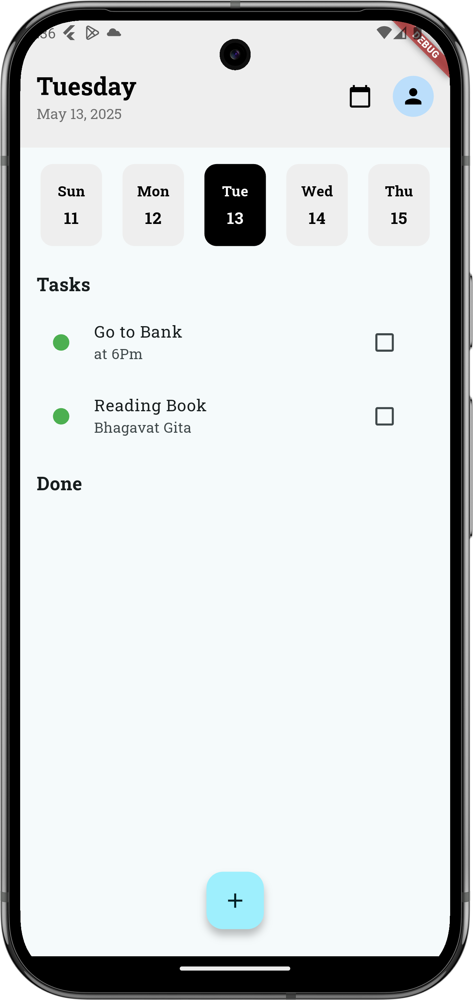
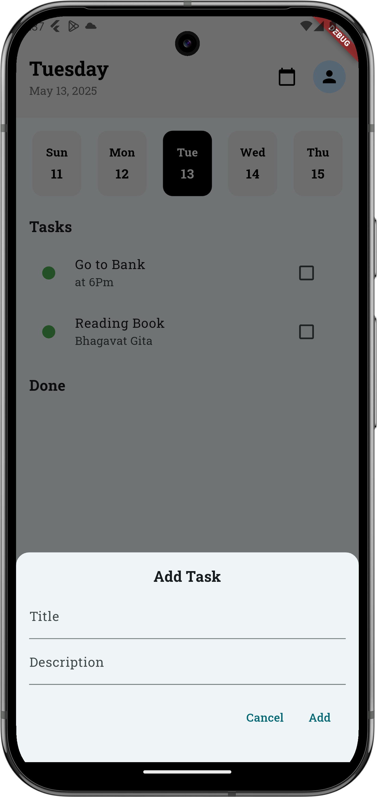

# TaskMate

<p align="center">
  
</p>

A simple and elegant task management app built with Flutter. This app allows users to manage their daily tasks efficiently by adding, updating, and deleting tasks. It also provides a progress graph to track completed and pending tasks.

---

## Screenshots

<p align="center">
  
  &nbsp;&nbsp;
  
</p>

---


## Features

- **Add Tasks**: Add new tasks with a title and description.
- **Update Tasks**: Edit existing tasks to modify their details.
- **Delete Tasks**: Swipe to delete tasks with an undo option.
- **Progress Graph**: Visualize the ratio of completed to pending tasks.
- **Responsive Design**: Optimized for different screen sizes using `flutter_screenutil`.
- **Persistent Storage**: Tasks are stored locally using SQLite or Hive (depending on implementation).


## Installation

1. Clone the repository:
   ```bash
   git clone https://github.com/me-vivek-kr/TaskMate.git
   ```
2. Navigate to the project directory:
   ```bash
   cd TaskMate
   ```
3. Install dependencies:
   ```bash
   flutter pub get
   ```
4. Run the app:
   ```bash
   flutter run
   ```

## Dependencies

- **GetX**: State management and navigation.
- **flutter_screenutil**: Responsive design.
- **intl**: Date formatting.
- **sqflite**: Local storage for tasks.

## How It Works

1. **Splash Screen**: Displays the app logo and transitions to the homepage after 2 seconds.
2. **Homepage**:
   - Displays the current date and day of the week.
   - Shows a progress graph for completed and pending tasks.
   - Lists tasks in "Tasks" and "Done" sections.
   - Floating action button to add new tasks.
3. **Dialogs**:
   - Add Task: Allows users to add a new task with a title and description.
   - Update Task: Allows users to edit an existing task.


Thank you for using TaskMate! 😊
